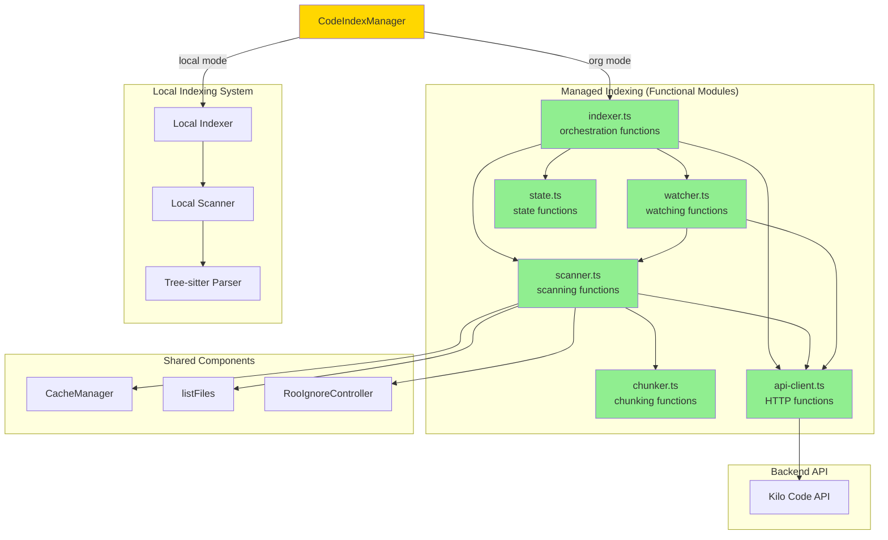

# Managed Codebase Indexing - Detailed Execution Plan

## Executive Summary

This plan outlines the implementation of a standalone **Managed Codebase Indexing** system for Kilo Code organization users. The new system will be completely separate from the existing local indexing code, featuring a simpler line-based chunking strategy, server-side embedding generation, and a **functional, stateless architecture** inspired by Go-style programming.

## Current State Analysis

### Existing POC Integration Points

Based on code analysis, the POC currently integrates at these points:

- **[`manager.ts`](../../src/services/code-index/manager.ts:472-507)**: Stores Kilo org props and passes them to scanner
- **[`config-manager.ts`](../../src/services/code-index/config-manager.ts:28-66)**: Manages Kilo org credentials and mode detection
- **[`scanner.ts`](../../src/services/code-index/processors/scanner.ts:210-523)**: Conditionally uses Kilo org indexing in batch processing
- **[`search-service.ts`](../../src/services/code-index/search-service.ts:44-68)**: Routes searches to Kilo org API
- **[`orchestrator.ts`](../../src/services/code-index/orchestrator.ts:25-44)**: Skips vector store/watcher in Kilo org mode
- **[`KiloOrgCodeIndexer.ts`](../../src/services/code-index/KiloOrgCodeIndexer.ts)**: API client for upsert/search operations

### Problems with Current POC

1. **Too many branch points**: Conditional logic scattered across 6+ files
2. **Reuses complex tree-sitter parsing**: Inherits recursive chunking complexity
3. **Tight coupling**: Shares scanner, orchestrator, and state management with local indexing
4. **Unclear separation**: UI doesn't distinguish between local and org indexing modes
5. **Class-based architecture**: Harder to test and reason about

---

## Architecture Design

### Git Branch Strategy

**Problem**: Without branch awareness, developers working on different branches would overwrite each other's embeddings for the same file paths, corrupting the index for the entire organization.

**Solution**: Branch-aware indexing with git metadata

#### Approach 1: Delta-Based Branch Indexing (Recommended)

**Problem**: Full indexes for every feature branch are too expensive (time, compute, storage).

**Solution**: Only index the **delta** (differences) between feature branches and their base branch.

##### Core Concept

- **Base branches** (main, develop): Full index
- **Feature branches**: Only store changes (additions, modifications, deletions)
- **Search**: Combine base branch index + feature branch delta

##### Data Model

```typescript
export interface ManagedCodeChunk {
	id: string
	organizationId: string
	filePath: string
	codeChunk: string
	startLine: number
	endLine: number
	chunkHash: string
	// Git metadata
	gitBranch: string // e.g., "main", "feature/new-api"
	gitCommitSha: string // Current commit SHA
	baseBranch?: string // For feature branches: "main" or "develop"
	isBaseBranch: boolean // true for main/develop, false for features
}

export interface BranchDelta {
	organizationId: string
	projectId: string
	featureBranch: string
	baseBranch: string
	baseCommitSha: string // Commit SHA where branch diverged
	addedFiles: string[] // Files added on feature branch
	modifiedFiles: string[] // Files modified on feature branch
	deletedFiles: string[] // Files deleted on feature branch
}
```

##### How It Works

**Base Branch (main)**:

- Full index of all files
- ~10,000 files = ~200,000 chunks
- Storage: ~500MB embeddings

**Feature Branch (feature/new-api)**:

- Only delta from main
- 5 files added, 3 modified, 2 deleted
- Storage: ~8 files × 20 chunks = ~160 chunks = ~400KB embeddings
- **99.92% storage savings!**

##### Implementation Strategy

```typescript
// When indexing a feature branch
async function indexFeatureBranch(config: ManagedIndexingConfig): Promise<void> {
	// 1. Determine base branch (main or develop)
	const baseBranch = await getBaseBranch(config.gitBranch)

	// 2. Get git diff between feature and base
	const diff = await getGitDiff(config.gitBranch, baseBranch)
	// Returns: { added: [...], modified: [...], deleted: [...] }

	// 3. Only index changed files
	const filesToIndex = [...diff.added, ...diff.modified]

	for (const file of filesToIndex) {
		const chunks = await chunkFile(file, config)

		// Mark chunks as belonging to feature branch
		chunks.forEach((chunk) => {
			chunk.gitBranch = config.gitBranch
			chunk.baseBranch = baseBranch
			chunk.isBaseBranch = false
		})

		await upsertChunks(chunks, config)
	}

	// 4. Store delta metadata
	await storeBranchDelta({
		organizationId: config.organizationId,
		projectId: config.projectId,
		featureBranch: config.gitBranch,
		baseBranch,
		baseCommitSha: await getCommitSha(baseBranch),
		addedFiles: diff.added,
		modifiedFiles: diff.modified,
		deletedFiles: diff.deleted,
	})
}
```

##### Search with Delta Composition

When searching a feature branch, combine base + delta:

```typescript
async function searchFeatureBranch(query: string, config: ManagedIndexingConfig): Promise<SearchResult[]> {
	// 1. Get branch delta
	const delta = await getBranchDelta(config.organizationId, config.projectId, config.gitBranch)

	// 2. Search base branch
	const baseResults = await searchCode({
		query,
		organizationId: config.organizationId,
		projectId: config.projectId,
		gitBranch: delta.baseBranch,
	})

	// 3. Search feature branch delta
	const deltaResults = await searchCode({
		query,
		organizationId: config.organizationId,
		projectId: config.projectId,
		gitBranch: config.gitBranch,
	})

	// 4. Combine results, applying delta rules
	return combineResults(baseResults, deltaResults, delta)
}

function combineResults(baseResults: SearchResult[], deltaResults: SearchResult[], delta: BranchDelta): SearchResult[] {
	const combined: SearchResult[] = []

	// Add all delta results (new/modified files)
	combined.push(...deltaResults)

	// Add base results, excluding deleted/modified files
	for (const result of baseResults) {
		const isDeleted = delta.deletedFiles.includes(result.filePath)
		const isModified = delta.modifiedFiles.includes(result.filePath)

		if (!isDeleted && !isModified) {
			combined.push(result)
		}
	}

	// Sort by relevance score
	return combined.sort((a, b) => b.score - a.score)
}
```

##### Database Schema

```sql
-- Base branch chunks (full index)
CREATE TABLE code_chunks (
  id UUID PRIMARY KEY,
  organization_id UUID NOT NULL,
  project_id UUID NOT NULL,
  git_branch VARCHAR(255) NOT NULL,
  file_path TEXT NOT NULL,
  code_chunk TEXT NOT NULL,
  start_line INTEGER NOT NULL,
  end_line INTEGER NOT NULL,
  chunk_hash VARCHAR(64) NOT NULL,
  embedding VECTOR(1536),  -- Embedding vector
  is_base_branch BOOLEAN NOT NULL,
  base_branch VARCHAR(255),  -- NULL for base branches
  created_at TIMESTAMP DEFAULT NOW()
);

-- Branch deltas (lightweight metadata)
CREATE TABLE branch_deltas (
  id UUID PRIMARY KEY,
  organization_id UUID NOT NULL,
  project_id UUID NOT NULL,
  feature_branch VARCHAR(255) NOT NULL,
  base_branch VARCHAR(255) NOT NULL,
  base_commit_sha VARCHAR(40) NOT NULL,
  added_files TEXT[],
  modified_files TEXT[],
  deleted_files TEXT[],
  created_at TIMESTAMP DEFAULT NOW(),
  UNIQUE(organization_id, project_id, feature_branch)
);

-- Indexes for efficient queries
CREATE INDEX idx_chunks_base_branch
  ON code_chunks(organization_id, project_id, git_branch)
  WHERE is_base_branch = true;

CREATE INDEX idx_chunks_feature_branch
  ON code_chunks(organization_id, project_id, git_branch)
  WHERE is_base_branch = false;
```

##### Cost Comparison

**Scenario**: 10,000 file codebase, 10 active feature branches

**Full Index Approach** (expensive):

- Main: 10,000 files × 20 chunks = 200,000 chunks
- Feature 1: 10,000 files × 20 chunks = 200,000 chunks
- Feature 2: 10,000 files × 20 chunks = 200,000 chunks
- ... (8 more feature branches)
- **Total: 2,200,000 chunks** (~5.5GB embeddings)
- **Index time per branch: ~30-60 minutes**

**Delta Approach** (efficient):

- Main: 10,000 files × 20 chunks = 200,000 chunks
- Feature 1: 10 changed files × 20 chunks = 200 chunks
- Feature 2: 8 changed files × 20 chunks = 160 chunks
- ... (8 more feature branches, avg 10 files each)
- **Total: 202,000 chunks** (~505MB embeddings)
- **Index time per feature branch: ~30-60 seconds**
- **91% storage savings, 60x faster indexing**

##### Git Diff Integration

```typescript
// Get files changed between branches
async function getGitDiff(
	featureBranch: string,
	baseBranch: string,
	workspacePath: string,
): Promise<{
	added: string[]
	modified: string[]
	deleted: string[]
}> {
	// Use git diff to find changes
	const { execSync } = require("child_process")

	// Get merge base (where branches diverged)
	const mergeBase = execSync(`git merge-base ${baseBranch} ${featureBranch}`, {
		cwd: workspacePath,
		encoding: "utf8",
	}).trim()

	// Get diff between merge base and feature branch
	const diffOutput = execSync(`git diff --name-status ${mergeBase}..${featureBranch}`, {
		cwd: workspacePath,
		encoding: "utf8",
	})

	const added: string[] = []
	const modified: string[] = []
	const deleted: string[] = []

	for (const line of diffOutput.split("\n")) {
		if (!line) continue

		const [status, ...pathParts] = line.split("\t")
		const filePath = pathParts.join("\t")

		switch (status[0]) {
			case "A":
				added.push(filePath)
				break
			case "M":
				modified.push(filePath)
				break
			case "D":
				deleted.push(filePath)
				break
			case "R": // Renamed - treat as delete + add
				deleted.push(pathParts[0])
				added.push(pathParts[1])
				break
		}
	}

	return { added, modified, deleted }
}
```

##### Branch Lifecycle

**1. Feature branch created**:

```typescript
// Developer creates feature/new-api from main
// Client detects new branch
const diff = await getGitDiff("feature/new-api", "main")
// diff = { added: [], modified: [], deleted: [] }  // No changes yet

// Store empty delta
await storeBranchDelta({
	featureBranch: "feature/new-api",
	baseBranch: "main",
	baseCommitSha: await getCommitSha("main"),
	addedFiles: [],
	modifiedFiles: [],
	deletedFiles: [],
})
```

**2. Developer makes changes**:

```typescript
// Developer adds newFeature.ts
// File watcher detects change
const diff = await getGitDiff("feature/new-api", "main")
// diff = { added: ['src/newFeature.ts'], modified: [], deleted: [] }

// Index only the new file
await indexFile("src/newFeature.ts", {
	gitBranch: "feature/new-api",
	baseBranch: "main",
	isBaseBranch: false,
})

// Update delta
await updateBranchDelta({
	featureBranch: "feature/new-api",
	addedFiles: ["src/newFeature.ts"],
})
```

**3. Feature branch merged**:

```typescript
// After merge to main, feature branch can be cleaned up
await deleteBranchDelta("feature/new-api")
await deleteFeatureBranchChunks("feature/new-api")

// Main branch gets re-indexed with new files
// (or incrementally updated based on merge commits)
```

##### Stale Branch Cleanup

```typescript
// Server-side cleanup job (runs daily)
async function cleanupStaleBranches(): Promise<void> {
	// Get all feature branch deltas
	const deltas = await getAllBranchDeltas()

	for (const delta of deltas) {
		// Check if branch still exists in git
		const branchExists = await checkRemoteBranch(delta.projectId, delta.featureBranch)

		if (!branchExists) {
			// Branch deleted - clean up delta and chunks
			await deleteBranchDelta(delta.featureBranch)
			await deleteFeatureBranchChunks(delta.featureBranch)

			console.log(`Cleaned up stale branch: ${delta.featureBranch}`)
		}
	}
}
```

##### Benefits of Delta Approach

1.  **Storage Efficiency**: 90%+ savings on embeddings storage
2.  **Fast Indexing**: Feature branches index in seconds, not minutes
3.  **Cost Effective**: Dramatically reduced embedding generation costs
4.  **Scalable**: Supports hundreds of feature branches
5.  **Accurate**: Search results reflect exact branch state
6.  **Clean**: Automatic cleanup of merged/deleted branches

        projectId: string
        filePath: string
        codeChunk: string
        startLine: number
        endLine: number
        chunkHash: string
        // Git metadata
        gitBranch: string // e.g., "main", "feature/new-api"
        gitCommitSha: string // Current commit SHA
        gitRemoteUrl: string // Repository URL for multi-repo orgs

    }

````

**Key Benefits**:

1. **Isolation**: Each branch has its own index space
2. **No conflicts**: Developers can't overwrite each other's work
3. **Branch-specific search**: Search within current branch context
4. **Cross-branch search**: Optionally search across branches
5. **Historical tracking**: Keep embeddings tied to specific commits

**Implementation Strategy**:

```typescript
// Get current git context
async function getGitContext(workspacePath: string): Promise<GitContext> {
	const branch = await getCurrentBranch(workspacePath)
	const commitSha = await getCurrentCommitSha(workspacePath)
	const remoteUrl = await getRemoteUrl(workspacePath)

	return { branch, commitSha, remoteUrl }
}

// Chunk ID includes branch for uniqueness
function generateChunkId(chunkHash: string, organizationId: string, gitBranch: string): string {
	// Include branch in ID to ensure uniqueness across branches
	const branchAwareHash = createHash("sha256").update(`${chunkHash}-${gitBranch}`).digest("hex")
	return uuidv5(branchAwareHash, organizationId)
}

// Search with branch context
async function searchCode(
	query: string,
	config: ManagedIndexingConfig,
	options?: {
		branch?: string // Default: current branch
		includeBranches?: string[] // Search across multiple branches
		includeAllBranches?: boolean // Search all branches
	},
): Promise<SearchResult[]>
````

**API Endpoint Updates**:

```typescript
// Upsert with git metadata
PUT /api/codebase-indexing/upsert
Body: {
  chunks: Array<{
    id: string
    organizationId: string
    projectId: string
    filePath: string
    codeChunk: string
    startLine: number
    endLine: number
    chunkHash: string
    gitBranch: string        // NEW
    gitCommitSha: string     // NEW
    gitRemoteUrl: string     // NEW
  }>
}

// Search with branch filtering
POST /api/codebase-indexing/search
Body: {
  query: string
  projectId: string
  organizationId: string
  path?: string
  gitBranch?: string         // NEW: Filter by branch
  includeBranches?: string[] // NEW: Search multiple branches
  includeAllBranches?: boolean // NEW: Search all branches
}

// Delete by branch
DELETE /api/codebase-indexing/files
Body: {
  projectId: string
  organizationId: string
  filePaths: string[]
  gitBranch: string          // NEW: Only delete from this branch
}
```

#### Approach 2: Main Branch Only (Simpler Alternative)

Only index the main/master branch, ignore feature branches:

**Pros**:

- Simpler implementation
- No branch conflicts
- Smaller index size
- Clear "source of truth"

**Cons**:

- Developers can't search their feature branch code
- Less useful during active development
- Requires switching to main to search new code

**Implementation**:

```typescript
async function shouldIndexBranch(workspacePath: string): Promise<boolean> {
	const branch = await getCurrentBranch(workspacePath)
	const mainBranches = ["main", "master", "develop"]
	return mainBranches.includes(branch)
}
```

#### Approach 3: Hybrid Strategy (Best of Both)

- **Main branch**: Always indexed, serves as organization baseline
- **Feature branches**: Indexed per-developer, with automatic cleanup
- **Search priority**: Current branch first, then main, then other branches

```typescript
interface SearchStrategy {
	// 1. Search current branch (if not main)
	currentBranch?: string

	// 2. Fall back to main branch
	includeMain: boolean

	// 3. Optionally search other branches
	includeOtherBranches?: boolean
}
```

**Recommended**: Start with **Approach 1 (Branch-Scoped)** for maximum flexibility, with option to configure search scope per user preference.

#### Branch Cleanup Strategy

To prevent index bloat from stale branches:

```typescript
// Server-side cleanup job
async function cleanupStaleBranches(organizationId: string, projectId: string) {
	// 1. Get all indexed branches
	const indexedBranches = await getIndexedBranches(organizationId, projectId)

	// 2. Get active branches from git remote
	const activeBranches = await getRemoteBranches(projectId)

	// 3. Delete embeddings for deleted branches
	const staleBranches = indexedBranches.filter((b) => !activeBranches.includes(b))

	for (const branch of staleBranches) {
		await deleteBranchEmbeddings(organizationId, projectId, branch)
	}
}
```

#### User Experience

#### Branch Isolation: How It Works

**Key Principle**: Each branch maintains its own independent index. Changes on one branch don't affect other branches.

##### Scenario: File Deleted on Feature Branch

**Setup**:

- `main` branch has `utils.ts`
- Developer creates `feature/refactor` branch
- Developer deletes `utils.ts` on feature branch
- `utils.ts` still exists on `main`

**What Happens**:

```typescript
// On feature/refactor branch
const chunks = [
  { id: "chunk1", filePath: "src/app.ts", gitBranch: "feature/refactor", ... },
  { id: "chunk2", filePath: "src/config.ts", gitBranch: "feature/refactor", ... },
  // utils.ts is NOT indexed (doesn't exist on this branch)
]

// On main branch (unchanged)
const chunks = [
  { id: "chunk1", filePath: "src/app.ts", gitBranch: "main", ... },
  { id: "chunk2", filePath: "src/config.ts", gitBranch: "main", ... },
  { id: "chunk3", filePath: "src/utils.ts", gitBranch: "main", ... },  // Still here!
]
```

**Database State**:

```sql
-- indexed_files table
organization_id | project_id | git_branch        | file_path      | file_hash
----------------|------------|-------------------|----------------|----------
org-123         | proj-456   | main              | src/utils.ts   | abc123
org-123         | proj-456   | feature/refactor  | src/app.ts     | def456
org-123         | proj-456   | feature/refactor  | src/config.ts  | ghi789
-- Note: No utils.ts entry for feature/refactor branch
```

**Search Behavior**:

```typescript
// Developer on feature/refactor searches for "utils"
const results = await searchCode({
	query: "utils",
	gitBranch: "feature/refactor", // Only search this branch
	organizationId: "org-123",
	projectId: "proj-456",
})
// Returns: No results (utils.ts not indexed on this branch)

// Developer on main searches for "utils"
const results = await searchCode({
	query: "utils",
	gitBranch: "main", // Only search main branch
	organizationId: "org-123",
	projectId: "proj-456",
})
// Returns: Results from utils.ts (still exists on main)
```

##### Scenario: File Added on Feature Branch

**Setup**:

- `main` branch doesn't have `newFeature.ts`
- Developer creates `feature/new-api` branch
- Developer adds `newFeature.ts` on feature branch

**What Happens**:

```typescript
// On feature/new-api branch
const chunks = [
  { id: "chunk1", filePath: "src/newFeature.ts", gitBranch: "feature/new-api", ... },
  // Other files...
]

// On main branch (unchanged)
const chunks = [
  // newFeature.ts is NOT here
  // Other files...
]
```

**Search Behavior**:

```typescript
// Developer on feature/new-api can search their new code
const results = await searchCode({
	query: "newFeature",
	gitBranch: "feature/new-api",
})
// Returns: Results from newFeature.ts

// Developer on main cannot see it
const results = await searchCode({
	query: "newFeature",
	gitBranch: "main",
})
// Returns: No results (file doesn't exist on main)
```

##### Scenario: File Modified on Feature Branch

**Setup**:

- `main` branch has `api.ts` with old implementation
- Developer creates `feature/improve-api` branch
- Developer modifies `api.ts` on feature branch

**What Happens**:

```typescript
// Both branches have the file, but with different content/hashes

// On main branch
{
  filePath: "src/api.ts",
  fileHash: "old-hash-123",
  gitBranch: "main",
  chunks: [
    { id: "chunk1-main", codeChunk: "old implementation", gitBranch: "main" }
  ]
}

// On feature/improve-api branch
{
  filePath: "src/api.ts",
  fileHash: "new-hash-456",  // Different hash!
  gitBranch: "feature/improve-api",
  chunks: [
    { id: "chunk1-feature", codeChunk: "new implementation", gitBranch: "feature/improve-api" }
  ]
}
```

**Search Behavior**:

```typescript
// Developer on feature branch sees new implementation
const results = await searchCode({
	query: "api implementation",
	gitBranch: "feature/improve-api",
})
// Returns: New implementation chunks

// Developer on main sees old implementation
const results = await searchCode({
	query: "api implementation",
	gitBranch: "main",
})
// Returns: Old implementation chunks
```

##### Cross-Branch Search

Users can optionally search across branches:

```typescript
// Search current branch + main
const results = await searchCode({
	query: "utils",
	gitBranch: "feature/refactor",
	includeBranches: ["main"], // Also search main
})
// Returns: Results from main's utils.ts (even though deleted on feature branch)

// Search all branches
const results = await searchCode({
	query: "utils",
	includeAllBranches: true,
})
// Returns: Results from all branches that have utils.ts
// Each result includes gitBranch metadata
```

##### Branch Merge Behavior

**When feature branch merges to main**:

1. **Before merge**: Both branches have independent indexes
2. **After merge**: Main branch gets updated
3. **Client behavior**:

    ```typescript
    // Developer switches from feature/refactor to main
    // Client detects branch switch
    const currentBranch = await getCurrentBranch() // "main"

    // Client syncs with server manifest for main branch
    const manifest = await getServerManifest({
    	organizationId: "org-123",
    	projectId: "proj-456",
    	gitBranch: "main",
    })

    // Client re-indexes based on main's current state
    // If utils.ts was deleted in merge, it gets removed from main's index
    ```

4. **Server cleanup**: Feature branch index can be cleaned up after merge (optional)

##### Database Queries

**Find file on specific branch**:

```sql
SELECT * FROM indexed_files
WHERE organization_id = 'org-123'
  AND project_id = 'proj-456'
  AND git_branch = 'feature/refactor'
  AND file_path = 'src/utils.ts';
-- Returns: Nothing (file deleted on this branch)

SELECT * FROM indexed_files
WHERE organization_id = 'org-123'
  AND project_id = 'proj-456'
  AND git_branch = 'main'
  AND file_path = 'src/utils.ts';
-- Returns: File record (still exists on main)
```

**Find all branches that have a file**:

```sql
SELECT git_branch, file_hash, last_indexed
FROM indexed_files
WHERE organization_id = 'org-123'
  AND project_id = 'proj-456'
  AND file_path = 'src/utils.ts';
-- Returns:
-- git_branch | file_hash | last_indexed
-- main       | abc123    | 2024-01-15
-- develop    | abc123    | 2024-01-14
-- (feature/refactor not in results - file deleted there)
```

##### Edge Cases Handled

1. **File deleted on feature, exists on main**:

    - ✅ Each branch maintains independent index
    - ✅ Search on feature branch won't find it
    - ✅ Search on main branch will find it
    - ✅ No conflicts or overwrites

2. **File added on feature, doesn't exist on main**:

    - ✅ Only indexed on feature branch
    - ✅ Main branch unaffected
    - ✅ After merge, gets added to main's index

3. **File modified on feature, different on main**:

    - ✅ Both versions indexed separately
    - ✅ Different chunk IDs (include branch in hash)
    - ✅ Search returns branch-appropriate version

4. **Multiple developers on same branch**:

    - ✅ Server deduplication prevents redundant indexing
    - ✅ Last-write-wins for file hash updates
    - ✅ Chunks with same hash are skipped

5. **Branch deleted remotely**:
    - ✅ Server cleanup job removes stale branch indexes
    - ✅ Client cache invalidated on next sync
    - ✅ No orphaned data

##### Implementation Details

**Chunk ID Generation** (includes branch):

```typescript
function generateChunkId(chunkHash: string, organizationId: string, gitBranch: string): string {
	// Include branch in ID to ensure uniqueness across branches
	const branchAwareHash = createHash("sha256").update(`${chunkHash}-${gitBranch}`).digest("hex")
	return uuidv5(branchAwareHash, organizationId)
}

// Example:
// Same file, same content, different branches = different IDs
const mainChunkId = generateChunkId("abc123", "org-123", "main")
// => "550e8400-e29b-41d4-a716-446655440000"

const featureChunkId = generateChunkId("abc123", "org-123", "feature/refactor")
// => "6ba7b810-9dad-11d1-80b4-00c04fd430c8"  // Different!
```

**Delete Operation** (branch-scoped):

```typescript
// Delete file only from current branch
async function deleteFile(filePath: string, config: ManagedIndexingConfig): Promise<void> {
	await axios.delete(`${baseUrl}/api/codebase-indexing/files`, {
		data: {
			organizationId: config.organizationId,
			projectId: config.projectId,
			gitBranch: config.gitBranch, // Only delete from this branch
			filePaths: [filePath],
		},
	})
}

// Server-side implementation
async function deleteFiles(req: DeleteFilesRequest): Promise<void> {
	await db.deleteChunks({
		organizationId: req.organizationId,
		projectId: req.projectId,
		gitBranch: req.gitBranch, // WHERE clause includes branch
		filePaths: req.filePaths,
	})

	await db.deleteIndexedFiles({
		organizationId: req.organizationId,
		projectId: req.projectId,
		gitBranch: req.gitBranch, // WHERE clause includes branch
		filePaths: req.filePaths,
	})
}
```

This branch isolation strategy ensures that:

- ✅ Developers never interfere with each other's work
- ✅ Each branch has an accurate index of its current state
- ✅ File deletions/additions on one branch don't affect others
- ✅ Search results are always branch-appropriate
- ✅ Merges are handled cleanly through re-indexing

**Default behavior**:

- Index current branch automatically
- Search current branch by default
- Show branch indicator in UI: "Indexing: feature/new-api"

**Advanced options**:

- Toggle "Index all branches" (for small repos)
- Toggle "Search all branches" (for cross-branch code discovery)
- Manual branch selection for search

**UI Updates**:

```typescript
interface IndexerState {
	status: "idle" | "scanning" | "watching" | "error"
	message: string
	gitBranch: string // NEW: Current branch
	gitCommitSha: string // NEW: Current commit
	lastSyncTime?: number
	totalFiles?: number
	totalChunks?: number
}
```

### Caching Strategy

**Problem**: Clients need to know what to index to avoid re-indexing unchanged files. The server needs to track what's already indexed to handle multiple clients efficiently.

#### How Local Cache Works

The local indexing system uses a client-side cache:

```typescript
// Stored in VSCode global storage
// File: roo-index-cache-{workspace-hash}.json
{
  "/path/to/file1.ts": "abc123...",  // SHA-256 hash of file content
  "/path/to/file2.ts": "def456...",
  ...
}
```

**Purpose**:

1. Skip unchanged files during scanning
2. Detect deleted files (in cache but not on disk)
3. Avoid redundant embedding generation
4. Fast startup (no need to re-scan everything)

#### Managed Indexing Cache Strategy

For managed indexing, we need **both client-side and server-side caching**:

##### 1. Client-Side Cache (Similar to Local)

Keep a local cache per workspace + branch:

```typescript
// File: managed-index-cache-{workspace-hash}-{branch-hash}.json
interface ClientCache {
	gitBranch: string
	gitCommitSha: string
	files: Record<
		string,
		{
			hash: string // File content hash
			lastIndexed: number // Timestamp
			chunkCount: number // Number of chunks generated
		}
	>
}
```

**Usage**:

```typescript
async function shouldIndexFile(filePath: string, currentHash: string, cache: ClientCache): Promise<boolean> {
	const cached = cache.files[filePath]

	// Index if:
	// 1. Not in cache (new file)
	// 2. Hash changed (file modified)
	// 3. Branch changed (different context)
	return !cached || cached.hash !== currentHash || cache.gitBranch !== currentBranch
}
```

**Benefits**:

- Fast local decisions (no API calls)
- Works offline (knows what's already indexed)
- Handles branch switches efficiently

##### 2. Server-Side Index Manifest

The server maintains a manifest of indexed files per project/branch:

```typescript
// Server-side database table: indexed_files
interface IndexedFileRecord {
	organizationId: string
	projectId: string
	gitBranch: string
	gitCommitSha: string
	filePath: string
	fileHash: string
	chunkCount: number
	lastIndexed: Date
	indexedBy: string // Client/user who indexed it
}

// Composite index on: (organizationId, projectId, gitBranch, filePath)
```

**API Endpoint**:

```typescript
// Get manifest for current branch
GET /api/codebase-indexing/manifest
Query: {
  organizationId: string
  projectId: string
  gitBranch: string
  gitCommitSha?: string    // Optional: get manifest for specific commit
}

Response: {
  files: Array<{
    filePath: string
    fileHash: string
    chunkCount: number
    lastIndexed: string
  }>
  totalFiles: number
  totalChunks: number
  lastUpdated: string
}
```

##### 3. Hybrid Sync Strategy

Combine client and server caches for optimal performance:

```typescript
async function syncWithServer(
	config: ManagedIndexingConfig,
	clientCache: ClientCache,
): Promise<{
	filesToIndex: string[]
	filesToDelete: string[]
}> {
	// 1. Get server manifest
	const serverManifest = await getServerManifest(config.organizationId, config.projectId, config.gitBranch)

	// 2. Get local files
	const localFiles = await scanLocalFiles(config.workspacePath)

	// 3. Determine what needs indexing
	const filesToIndex: string[] = []
	const filesToDelete: string[] = []

	for (const localFile of localFiles) {
		const localHash = await getFileHash(localFile)
		const serverFile = serverManifest.files.find((f) => f.filePath === localFile)
		const clientFile = clientCache.files[localFile]

		// Index if:
		// - Not on server
		// - Server hash differs from local
		// - Client cache is stale
		if (!serverFile || serverFile.fileHash !== localHash || !clientFile || clientFile.hash !== localHash) {
			filesToIndex.push(localFile)
		}
	}

	// Find files to delete (on server but not local)
	for (const serverFile of serverManifest.files) {
		if (!localFiles.includes(serverFile.filePath)) {
			filesToDelete.push(serverFile.filePath)
		}
	}

	return { filesToIndex, filesToDelete }
}
```

##### 4. Optimized Initial Scan

On first scan or branch switch:

```typescript
async function performInitialScan(config: ManagedIndexingConfig, clientCache: ClientCache): Promise<void> {
	// 1. Check if client cache matches current branch
	if (clientCache.gitBranch !== config.gitBranch) {
		// Branch switched - need to re-evaluate everything
		clientCache = createEmptyCache(config.gitBranch)
	}

	// 2. Sync with server to get current state
	const { filesToIndex, filesToDelete } = await syncWithServer(config, clientCache)

	// 3. Delete stale files from server
	if (filesToDelete.length > 0) {
		await deleteFiles(filesToDelete, config)
	}

	// 4. Index new/changed files
	if (filesToIndex.length > 0) {
		await indexFiles(filesToIndex, config, clientCache)
	}

	// 5. Update client cache
	await saveClientCache(clientCache)
}
```

##### 5. Incremental Updates (File Watcher)

When files change:

```typescript
async function handleFileChange(
	filePath: string,
	changeType: "created" | "changed" | "deleted",
	config: ManagedIndexingConfig,
	clientCache: ClientCache,
): Promise<void> {
	switch (changeType) {
		case "deleted":
			// Delete from server and client cache
			await deleteFiles([filePath], config)
			delete clientCache.files[filePath]
			break

		case "created":
		case "changed":
			// Re-index file
			const fileHash = await getFileHash(filePath)
			const chunks = await chunkFile(filePath, fileHash, config)
			await upsertChunks(chunks, config)

			// Update client cache
			clientCache.files[filePath] = {
				hash: fileHash,
				lastIndexed: Date.now(),
				chunkCount: chunks.length,
			}
			break
	}

	await saveClientCache(clientCache)
}
```

##### 6. Multi-Client Coordination

Handle multiple developers indexing the same project:

**Server-side deduplication**:

```typescript
// When upserting chunks, server checks:
async function upsertChunks(chunks: ManagedCodeChunk[]): Promise<void> {
	for (const chunk of chunks) {
		// Check if chunk already exists with same hash
		const existing = await db.findChunk({
			organizationId: chunk.organizationId,
			projectId: chunk.projectId,
			gitBranch: chunk.gitBranch,
			filePath: chunk.filePath,
			startLine: chunk.startLine,
			endLine: chunk.endLine,
		})

		if (existing && existing.chunkHash === chunk.chunkHash) {
			// Skip - already indexed with same content
			continue
		}

		// Upsert (insert or update)
		await db.upsertChunk(chunk)
	}
}
```

**Client-side optimization**:

```typescript
// Before indexing, check if another client already did it
async function shouldSkipFile(filePath: string, fileHash: string, config: ManagedIndexingConfig): Promise<boolean> {
	// Quick check: is file in client cache with matching hash?
	const cached = clientCache.files[filePath]
	if (cached && cached.hash === fileHash) {
		return true
	}

	// Optional: Check server manifest (adds latency)
	// Only do this for large files or on slow connections
	if (fileSize > 100_000) {
		// 100KB
		const serverFile = await getServerFileInfo(filePath, config)
		if (serverFile && serverFile.fileHash === fileHash) {
			// Update client cache and skip
			clientCache.files[filePath] = {
				hash: fileHash,
				lastIndexed: Date.now(),
				chunkCount: serverFile.chunkCount,
			}
			return true
		}
	}

	return false
}
```

##### 7. Cache Invalidation

Handle cache invalidation scenarios:

```typescript
// Clear client cache when:
// 1. Branch deleted remotely
// 2. Force re-index requested
// 3. Cache corruption detected
async function invalidateCache(
	reason: "branch_deleted" | "force_reindex" | "corruption",
	config: ManagedIndexingConfig,
): Promise<void> {
	// Clear client cache
	await clearClientCache(config)

	// Optionally clear server cache (admin action)
	if (reason === "force_reindex") {
		await deleteAllChunks(config.organizationId, config.projectId, config.gitBranch)
	}

	// Trigger full re-scan
	await performInitialScan(config, createEmptyCache(config.gitBranch))
}
```

#### Cache Storage Locations

**Client-side**:

```
~/.vscode/extensions/kilocode/global-storage/
  managed-index-cache-{workspace-hash}-{branch-hash}.json
```

**Server-side**:

```sql
-- PostgreSQL schema
CREATE TABLE indexed_files (
  id UUID PRIMARY KEY,
  organization_id UUID NOT NULL,
  project_id UUID NOT NULL,
  git_branch VARCHAR(255) NOT NULL,
  git_commit_sha VARCHAR(40) NOT NULL,
  file_path TEXT NOT NULL,
  file_hash VARCHAR(64) NOT NULL,
  chunk_count INTEGER NOT NULL,
  last_indexed TIMESTAMP NOT NULL,
  indexed_by VARCHAR(255),
  UNIQUE(organization_id, project_id, git_branch, file_path)
);

CREATE INDEX idx_indexed_files_lookup
  ON indexed_files(organization_id, project_id, git_branch);
```

#### Performance Characteristics

**Initial scan** (1000 files):

- Without cache: ~30-60 seconds (index everything)
- With client cache: ~5-10 seconds (only changed files)
- With server manifest: ~2-5 seconds (skip already indexed)

**Incremental update** (1 file changed):

- Without cache: ~1-2 seconds (re-index file)
- With cache: ~500ms (detect change, re-index)

**Branch switch**:

- Without cache: ~30-60 seconds (full re-scan)
- With cache: ~5-10 seconds (sync with server manifest)

#### Implementation Priority

1. **Phase 1**: Client-side cache only (like local indexing)
2. **Phase 2**: Add server manifest API
3. **Phase 3**: Implement hybrid sync strategy
4. **Phase 4**: Add multi-client coordination

### New Standalone Components

```
src/services/code-index/
├── managed/                          # NEW: Managed indexing system
│   ├── indexer.ts                   # Main orchestration functions
│   ├── scanner.ts                   # File scanning functions
│   ├── watcher.ts                   # File watching functions
│   ├── chunker.ts                   # Line-based chunking functions
│   ├── api-client.ts                # Server API communication functions
│   ├── state.ts                     # State management functions
│   └── types.ts                     # Type definitions and interfaces
├── manager.ts                        # MODIFIED: Route to managed or local
├── config-manager.ts                 # MODIFIED: Manage both modes
└── KiloOrgCodeIndexer.ts            # DEPRECATED: Replaced by api-client.ts
```

### Key Architectural Principles

1. **Complete Separation**: Managed indexing has its own scanner, watcher, and orchestrator
2. **Functional & Stateless**: Pure functions grouped by module (Go-style)
3. **Simple Chunking**: Line-based with configurable overlap, no tree-sitter dependency
4. **Server-Side Embeddings**: No client-side embedding generation
5. **Transparent Operation**: Minimal user configuration required
6. **Dual UI Sections**: Clear separation in settings/status UI

---

## Detailed Implementation Plan

### Phase 1: Architecture & Design

**Goal**: Define types and data structures for the new system

**Tasks**:

1. Create `src/services/code-index/managed/types.ts`

    ```typescript
    // Core data types
    export interface ManagedCodeChunk {
    	id: string
    	organizationId: string
    	projectId: string
    	filePath: string
    	codeChunk: string
    	startLine: number
    	endLine: number
    	chunkHash: string
    }

    export interface ChunkerConfig {
    	maxChunkChars: number
    	minChunkChars: number
    	overlapLines: number
    }

    export interface ManagedIndexingConfig {
    	organizationId: string
    	projectId: string
    	kilocodeToken: string
    	workspacePath: string
    	maxChunkChars: number
    	minChunkChars: number
    	overlapLines: number
    	batchSize: number
    	autoSync: boolean
    }

    export interface ScanProgress {
    	filesProcessed: number
    	filesTotal: number
    	chunksIndexed: number
    	currentFile?: string
    }

    export interface ManagedScanResult {
    	success: boolean
    	filesProcessed: number
    	filesSkipped: number
    	chunksIndexed: number
    	errors: Error[]
    }

    export interface FileChangeEvent {
    	type: "created" | "changed" | "deleted"
    	filePath: string
    	timestamp: number
    }

    export interface IndexerState {
    	status: "idle" | "scanning" | "watching" | "error"
    	message: string
    	lastSyncTime?: number
    	totalFiles?: number
    	totalChunks?: number
    }
    ```

2. Design line-based chunking algorithm

    - **Max chunk size**: 1000 characters (configurable)
    - **Min chunk size**: 200 characters
    - **Overlap lines**: 5 lines (configurable)
    - **Strategy**: Accumulate full lines until max size, then create chunk with overlap

3. Define API contract with backend
    - Upsert endpoint: `PUT /api/codebase-indexing/upsert`
    - Search endpoint: `POST /api/codebase-indexing/search`
    - Delete endpoint: `DELETE /api/codebase-indexing/files`

**Deliverables**:

- Type definitions file
- Architecture diagram (Mermaid)
- API contract specification

---

### Phase 2: Create New Line-Based Chunking System

**Goal**: Implement simple, efficient file chunking without tree-sitter

**Tasks**:

1. Create `chunker.ts` with pure functions

    ```typescript
    import { createHash } from "crypto"
    import { v5 as uuidv5 } from "uuid"
    import { ManagedCodeChunk, ChunkerConfig } from "./types"

    /**
     * Chunks a file's content into overlapping segments based on line boundaries
     */
    export function chunkFile(
    	filePath: string,
    	content: string,
    	fileHash: string,
    	organizationId: string,
    	projectId: string,
    	config: ChunkerConfig,
    ): ManagedCodeChunk[] {
    	const lines = content.split("\n")
    	const chunks: ManagedCodeChunk[] = []

    	let currentChunk: string[] = []
    	let currentChunkChars = 0
    	let startLine = 1

    	for (let i = 0; i < lines.length; i++) {
    		const line = lines[i]
    		const lineLength = line.length + 1 // +1 for newline

    		// Check if adding this line would exceed max
    		if (currentChunkChars + lineLength > config.maxChunkChars && currentChunk.length > 0) {
    			// Finalize current chunk if it meets minimum size
    			if (currentChunkChars >= config.minChunkChars) {
    				chunks.push(createChunk(currentChunk, startLine, i, filePath, fileHash, organizationId, projectId))

    				// Start next chunk with overlap
    				const overlapStart = Math.max(0, currentChunk.length - config.overlapLines)
    				currentChunk = currentChunk.slice(overlapStart)
    				currentChunkChars = currentChunk.join("\n").length
    				startLine = i - (currentChunk.length - 1)
    			}
    		}

    		currentChunk.push(line)
    		currentChunkChars += lineLength
    	}

    	// Finalize last chunk
    	if (currentChunk.length > 0 && currentChunkChars >= config.minChunkChars) {
    		chunks.push(
    			createChunk(currentChunk, startLine, lines.length, filePath, fileHash, organizationId, projectId),
    		)
    	}

    	return chunks
    }

    /**
     * Creates a single chunk with metadata
     */
    function createChunk(
    	lines: string[],
    	startLine: number,
    	endLine: number,
    	filePath: string,
    	fileHash: string,
    	organizationId: string,
    	projectId: string,
    ): ManagedCodeChunk {
    	const content = lines.join("\n")
    	const chunkHash = generateChunkHash(filePath, startLine, endLine, content)
    	const id = uuidv5(chunkHash, organizationId)

    	return {
    		id,
    		organizationId,
    		projectId,
    		filePath,
    		codeChunk: content,
    		startLine,
    		endLine,
    		chunkHash,
    	}
    }

    /**
     * Generates a unique hash for a chunk
     */
    function generateChunkHash(filePath: string, startLine: number, endLine: number, content: string): string {
    	const contentPreview = content.slice(0, 100)
    	return createHash("sha256")
    		.update(`${filePath}-${startLine}-${endLine}-${content.length}-${contentPreview}`)
    		.digest("hex")
    }
    ```

2. Implement helper functions:

    - `chunkFile()`: Main chunking function
    - `createChunk()`: Creates chunk with metadata
    - `generateChunkHash()`: Generates unique hash

3. Handle edge cases:
    - Empty files
    - Single long lines (>maxChunkChars)
    - Files smaller than minChunkChars

**Deliverables**:

- `chunker.ts` implementation with pure functions
- Unit tests for chunking logic
- Performance benchmarks vs tree-sitter approach

---

### Phase 3: Build Managed File Scanner

**Goal**: Create dedicated scanner for organization indexing

**Tasks**:

1. Create `scanner.ts` with functional approach

    ```typescript
    import { listFiles } from "../../glob/list-files"
    import { RooIgnoreController } from "../../../core/ignore/RooIgnoreController"
    import { CacheManager } from "../cache-manager"
    import { chunkFile } from "./chunker"
    import { upsertChunks } from "./api-client"
    import { ManagedIndexingConfig, ScanProgress, ManagedScanResult } from "./types"
    import pLimit from "p-limit"

    /**
     * Scans a directory and indexes all supported files
     */
    export async function scanDirectory(
    	config: ManagedIndexingConfig,
    	cacheManager: CacheManager,
    	onProgress?: (progress: ScanProgress) => void,
    ): Promise<ManagedScanResult> {
    	// Get all files
    	const [allPaths] = await listFiles(config.workspacePath, true, 50000)
    	const filePaths = allPaths.filter((p) => !p.endsWith("/"))

    	// Filter files
    	const supportedFiles = await filterSupportedFiles(filePaths, config.workspacePath, cacheManager)

    	// Process files in parallel
    	const result = await processFiles(supportedFiles, config, cacheManager, onProgress)

    	return result
    }

    /**
     * Filters files by extension, ignore rules, and cache
     */
    async function filterSupportedFiles(
    	filePaths: string[],
    	workspacePath: string,
    	cacheManager: CacheManager,
    ): Promise<string[]> {
    	// Implementation details...
    	return filePaths
    }

    /**
     * Processes files in parallel with batching
     */
    async function processFiles(
    	filePaths: string[],
    	config: ManagedIndexingConfig,
    	cacheManager: CacheManager,
    	onProgress?: (progress: ScanProgress) => void,
    ): Promise<ManagedScanResult> {
    	const limit = pLimit(10) // 10 concurrent files
    	const errors: Error[] = []
    	let filesProcessed = 0
    	let filesSkipped = 0
    	let chunksIndexed = 0

    	const promises = filePaths.map((filePath) =>
    		limit(async () => {
    			try {
    				const result = await processFile(filePath, config, cacheManager)
    				if (result.skipped) {
    					filesSkipped++
    				} else {
    					filesProcessed++
    					chunksIndexed += result.chunksIndexed
    				}

    				onProgress?.({
    					filesProcessed,
    					filesTotal: filePaths.length,
    					chunksIndexed,
    					currentFile: filePath,
    				})
    			} catch (error) {
    				errors.push(error as Error)
    			}
    		}),
    	)

    	await Promise.all(promises)

    	return {
    		success: errors.length === 0,
    		filesProcessed,
    		filesSkipped,
    		chunksIndexed,
    		errors,
    	}
    }

    /**
     * Processes a single file
     */
    async function processFile(
    	filePath: string,
    	config: ManagedIndexingConfig,
    	cacheManager: CacheManager,
    ): Promise<{ skipped: boolean; chunksIndexed: number }> {
    	// Read file, check cache, chunk, and upsert
    	// Implementation details...
    	return { skipped: false, chunksIndexed: 0 }
    }
    ```

2. Implement scanning functions:

    - `scanDirectory()`: Main entry point
    - `filterSupportedFiles()`: Apply filters and ignore rules
    - `processFiles()`: Parallel file processing
    - `processFile()`: Single file processing
    - `batchAndUpsert()`: Batch chunks and send to API

3. Implement parallel processing:
    - Use `p-limit` for concurrency control
    - Batch chunks for API calls (60 chunks per batch)
    - Handle errors gracefully

**Deliverables**:

- `scanner.ts` implementation with pure functions
- Integration with `CacheManager`
- Progress reporting callbacks
- Error handling

---

### Phase 4: Implement File Watching

**Goal**: Add file change detection for managed indexing

**Tasks**:

1. Create `watcher.ts` with functional approach

    ```typescript
    import * as vscode from "vscode"
    import { ManagedIndexingConfig, FileChangeEvent } from "./types"
    import { processFile } from "./scanner"
    import { deleteFiles } from "./api-client"
    import { CacheManager } from "../cache-manager"

    /**
     * Creates and initializes a file watcher
     */
    export function createFileWatcher(
    	config: ManagedIndexingConfig,
    	cacheManager: CacheManager,
    	onFilesChanged?: (events: FileChangeEvent[]) => void,
    ): vscode.Disposable {
    	const watcher = vscode.workspace.createFileSystemWatcher("**/*")
    	const changeQueue: FileChangeEvent[] = []
    	let debounceTimer: NodeJS.Timeout | null = null

    	const handleChange = (uri: vscode.Uri, type: FileChangeEvent["type"]) => {
    		changeQueue.push({
    			type,
    			filePath: uri.fsPath,
    			timestamp: Date.now(),
    		})

    		// Debounce processing
    		if (debounceTimer) {
    			clearTimeout(debounceTimer)
    		}
    		debounceTimer = setTimeout(() => {
    			processChangeQueue(changeQueue, config, cacheManager, onFilesChanged)
    			changeQueue.length = 0
    		}, 500)
    	}

    	watcher.onDidCreate((uri) => handleChange(uri, "created"))
    	watcher.onDidChange((uri) => handleChange(uri, "changed"))
    	watcher.onDidDelete((uri) => handleChange(uri, "deleted"))

    	return watcher
    }

    /**
     * Processes a queue of file changes
     */
    async function processChangeQueue(
    	events: FileChangeEvent[],
    	config: ManagedIndexingConfig,
    	cacheManager: CacheManager,
    	onFilesChanged?: (events: FileChangeEvent[]) => void,
    ): Promise<void> {
    	// Group by type
    	const created = events.filter((e) => e.type === "created")
    	const changed = events.filter((e) => e.type === "changed")
    	const deleted = events.filter((e) => e.type === "deleted")

    	// Process deletions
    	if (deleted.length > 0) {
    		await deleteFiles(
    			deleted.map((e) => e.filePath),
    			config.organizationId,
    			config.projectId,
    			config.kilocodeToken,
    		)
    	}

    	// Process created/changed files
    	const toProcess = [...created, ...changed]
    	for (const event of toProcess) {
    		await processFile(event.filePath, config, cacheManager)
    	}

    	onFilesChanged?.(events)
    }
    ```

2. Implement file watching functions:

    - `createFileWatcher()`: Creates watcher with debouncing
    - `processChangeQueue()`: Processes batched changes
    - `handleFileChange()`: Routes changes to appropriate handlers

3. Implement change processing:
    - **Created/Changed files**: Re-chunk and upsert to server
    - **Deleted files**: Send delete request to server
    - Update cache after successful processing

**Deliverables**:

- `watcher.ts` implementation with functional approach
- Debouncing and batching logic
- Error handling and recovery

---

### Phase 5: Create Managed Indexer Service

**Goal**: Build the main orchestration service

**Tasks**:

1. Create `api-client.ts` with pure functions

    ```typescript
    import axios from "axios"
    import { getKiloBaseUriFromToken } from "../../../shared/kilocode/token"
    import { ManagedCodeChunk } from "./types"

    /**
     * Upserts chunks to the server
     */
    export async function upsertChunks(chunks: ManagedCodeChunk[], kilocodeToken: string): Promise<void> {
    	const baseUrl = getKiloBaseUriFromToken(kilocodeToken)

    	await axios({
    		method: "PUT",
    		url: `${baseUrl}/api/codebase-indexing/upsert`,
    		data: chunks,
    		headers: {
    			Authorization: `Bearer ${kilocodeToken}`,
    			"Content-Type": "application/json",
    		},
    	})
    }

    /**
     * Searches code in the index
     */
    export async function searchCode(
    	query: string,
    	organizationId: string,
    	projectId: string,
    	kilocodeToken: string,
    	path?: string,
    ): Promise<SearchResult[]> {
    	const baseUrl = getKiloBaseUriFromToken(kilocodeToken)

    	const response = await axios({
    		method: "POST",
    		url: `${baseUrl}/api/codebase-indexing/search`,
    		data: { query, organizationId, projectId, path },
    		headers: {
    			Authorization: `Bearer ${kilocodeToken}`,
    			"Content-Type": "application/json",
    		},
    	})

    	return response.data
    }

    /**
     * Deletes files from the index
     */
    export async function deleteFiles(
    	filePaths: string[],
    	organizationId: string,
    	projectId: string,
    	kilocodeToken: string,
    ): Promise<void> {
    	const baseUrl = getKiloBaseUriFromToken(kilocodeToken)

    	await axios({
    		method: "DELETE",
    		url: `${baseUrl}/api/codebase-indexing/files`,
    		data: { filePaths, organizationId, projectId },
    		headers: {
    			Authorization: `Bearer ${kilocodeToken}`,
    			"Content-Type": "application/json",
    		},
    	})
    }
    ```

2. Create `indexer.ts` with orchestration functions

    ```typescript
    import * as vscode from "vscode"
    import { scanDirectory } from "./scanner"
    import { createFileWatcher } from "./watcher"
    import { searchCode } from "./api-client"
    import { ManagedIndexingConfig, IndexerState } from "./types"
    import { CacheManager } from "../cache-manager"

    /**
     * Initializes and starts the managed indexer
     */
    export async function startIndexing(
    	config: ManagedIndexingConfig,
    	context: vscode.ExtensionContext,
    	onStateChange?: (state: IndexerState) => void,
    ): Promise<vscode.Disposable> {
    	const cacheManager = new CacheManager(context, config.workspacePath)
    	await cacheManager.initialize()

    	// Update state
    	onStateChange?.({
    		status: "scanning",
    		message: "Starting initial scan...",
    	})

    	// Perform initial scan
    	const result = await scanDirectory(config, cacheManager, (progress) => {
    		onStateChange?.({
    			status: "scanning",
    			message: `Scanning: ${progress.filesProcessed}/${progress.filesTotal} files`,
    		})
    	})

    	// Start file watcher
    	const watcher = createFileWatcher(config, cacheManager, (events) => {
    		onStateChange?.({
    			status: "watching",
    			message: `Processed ${events.length} file changes`,
    		})
    	})

    	// Update final state
    	onStateChange?.({
    		status: "watching",
    		message: "Index up-to-date. Watching for changes...",
    		lastSyncTime: Date.now(),
    		totalFiles: result.filesProcessed,
    		totalChunks: result.chunksIndexed,
    	})

    	return watcher
    }

    /**
     * Searches the managed index
     */
    export async function search(query: string, config: ManagedIndexingConfig, path?: string): Promise<SearchResult[]> {
    	return searchCode(query, config.organizationId, config.projectId, config.kilocodeToken, path)
    }
    ```

3. Create `state.ts` for state management

    ```typescript
    import { EventEmitter } from "events"
    import { IndexerState } from "./types"

    /**
     * Creates a state manager with event emission
     */
    export function createStateManager() {
    	const emitter = new EventEmitter()
    	let currentState: IndexerState = {
    		status: "idle",
    		message: "",
    	}

    	return {
    		getState: () => currentState,
    		setState: (state: Partial<IndexerState>) => {
    			currentState = { ...currentState, ...state }
    			emitter.emit("stateChange", currentState)
    		},
    		onStateChange: (callback: (state: IndexerState) => void) => {
    			emitter.on("stateChange", callback)
    			return () => emitter.off("stateChange", callback)
    		},
    	}
    }
    ```

**Deliverables**:

- `api-client.ts` with HTTP functions
- `indexer.ts` with orchestration functions
- `state.ts` for state management
- Error handling and retry logic

---

### Phase 6: Update UI Components

**Goal**: Separate local and organization indexing sections in UI

**Tasks**:

1. Modify `manager.ts`:

    - Add functions to route to managed or local indexing
    - Initialize appropriate indexer based on organization status
    - Provide unified API for both modes

2. Update settings UI:

    - Create two distinct sections:
        - **Local Codebase Indexing**: Existing configuration
        - **Organization Codebase Indexing**: Status display only
    - Show organization indexing status (enabled/disabled, progress)
    - Add "Refresh Index" button for organization mode
    - Display last sync time and file count

3. Update status bar:

    - Show different icons for local vs organization mode
    - Display appropriate status messages
    - Handle both modes being active simultaneously

4. Update webview messages:
    - Add new message types for managed indexing
    - Route search requests to appropriate indexer
    - Provide separate status updates for each mode

**Deliverables**:

- Modified `manager.ts` with dual-mode support
- Updated settings UI with separate sections
- Enhanced status bar indicators
- New webview message handlers

---

### Phase 7: Integration & Testing

**Goal**: Connect all components and validate functionality

**Tasks**:

1. Integration testing:

    - Test initial scan with various project sizes
    - Test file watching and incremental updates
    - Test search functionality
    - Test error handling and recovery
    - Test cancellation and cleanup

2. Performance testing:

    - Benchmark line-based chunking vs tree-sitter
    - Measure memory usage during large scans
    - Test concurrent file processing
    - Validate batch API call efficiency

3. Edge case testing:

    - Empty workspace
    - Very large files (>1MB)
    - Binary files
    - Rapid file changes
    - Network failures
    - Invalid credentials

4. Create comprehensive test suite:
    - Unit tests for `chunker.ts` functions
    - Unit tests for `scanner.ts` functions
    - Integration tests for `indexer.ts` functions
    - E2E tests for full workflow

**Deliverables**:

- Comprehensive test suite
- Performance benchmarks
- Bug fixes and optimizations
- Test coverage report

---

### Phase 8: Documentation & Cleanup

**Goal**: Document the new system and remove POC code

**Tasks**:

1. Remove POC code:

    - Remove Kilo org conditional logic from `scanner.ts`
    - Remove Kilo org logic from `orchestrator.ts`
    - Remove Kilo org logic from `search-service.ts`
    - Deprecate `KiloOrgCodeIndexer.ts`
    - Clean up config manager Kilo org methods

2. Update documentation:

    - Document line-based chunking algorithm
    - Document API contract with backend
    - Document configuration options
    - Create architecture diagrams
    - Update user-facing documentation

3. Add inline documentation:

    - JSDoc comments for all public functions
    - Explain chunking algorithm with examples
    - Document error handling strategies
    - Add usage examples

4. Create migration guide:
    - Explain differences from POC
    - Document breaking changes
    - Provide upgrade instructions

**Deliverables**:

- Clean codebase without POC remnants
- Comprehensive documentation
- Architecture diagrams
- Migration guide

---

## Configuration & Constants

### New Constants (add to `constants/index.ts`)

```typescript
/** Managed Indexing */
export const MANAGED_MAX_CHUNK_CHARS = 1000
export const MANAGED_MIN_CHUNK_CHARS = 200
export const MANAGED_OVERLAP_LINES = 5
export const MANAGED_BATCH_SIZE = 60
export const MANAGED_FILE_WATCH_DEBOUNCE_MS = 500
export const MANAGED_MAX_CONCURRENT_FILES = 10
export const MANAGED_MAX_CONCURRENT_BATCHES = 10
```

### Configuration Options

```typescript
interface ManagedIndexingConfig {
	enabled: boolean // Auto-enabled for org users
	maxChunkChars: number // Default: 1000
	minChunkChars: number // Default: 200
	overlapLines: number // Default: 5
	batchSize: number // Default: 60
	autoSync: boolean // Default: true
	syncInterval: number // Default: 5 minutes
}
```

---

## API Endpoints

### Upsert Chunks

```
PUT /api/codebase-indexing/upsert
Authorization: Bearer {kilocodeToken}

Body: {
  chunks: Array<{
    id: string
    organizationId: string
    projectId: string
    filePath: string
    codeChunk: string
    startLine: number
    endLine: number
    chunkHash: string
  }>
}
```

### Search Code

```
POST /api/codebase-indexing/search
Authorization: Bearer {kilocodeToken}

Body: {
  query: string
  projectId: string
  organizationId: string
  path?: string
}

Response: Array<{
  id: string
  filePath: string
  codeChunk: string
  startLine: number
  endLine: number
  score: number
}>
```

### Delete Files

```
DELETE /api/codebase-indexing/files
Authorization: Bearer {kilocodeToken}

Body: {
  projectId: string
  organizationId: string
  filePaths: string[]
}
```

---

## Line-Based Chunking Algorithm

### Overview

The line-based chunking algorithm is designed for simplicity and speed, avoiding the complexity of tree-sitter parsing while maintaining good semantic boundaries.

### Algorithm Steps

1. **Split into lines**: `const lines = content.split('\n')`

2. **Initialize state**:

    ```typescript
    let currentChunk: string[] = []
    let currentChunkChars = 0
    let chunks: ManagedCodeChunk[] = []
    let startLine = 1
    ```

3. **Process each line**:

    ```typescript
    for (let i = 0; i < lines.length; i++) {
    	const line = lines[i]
    	const lineLength = line.length + 1 // +1 for newline

    	// Check if adding this line would exceed max
    	if (currentChunkChars + lineLength > maxChunkChars && currentChunk.length > 0) {
    		// Finalize current chunk if it meets minimum size
    		if (currentChunkChars >= minChunkChars) {
    			chunks.push(createChunk(currentChunk, startLine, i))

    			// Start next chunk with overlap
    			const overlapStart = Math.max(0, currentChunk.length - overlapLines)
    			currentChunk = currentChunk.slice(overlapStart)
    			currentChunkChars = currentChunk.join("\n").length
    			startLine = i - (currentChunk.length - 1)
    		}
    	}

    	currentChunk.push(line)
    	currentChunkChars += lineLength
    }
    ```

4. **Finalize last chunk**:
    ```typescript
    if (currentChunk.length > 0 && currentChunkChars >= minChunkChars) {
    	chunks.push(createChunk(currentChunk, startLine, lines.length))
    }
    ```

### Example

Given a file with 100 lines, max 1000 chars, min 200 chars, 5 line overlap:

```
Chunk 1: Lines 1-25   (950 chars)
Chunk 2: Lines 21-45  (980 chars) - overlaps lines 21-25
Chunk 3: Lines 41-65  (960 chars) - overlaps lines 41-45
Chunk 4: Lines 61-85  (940 chars) - overlaps lines 61-65
Chunk 5: Lines 81-100 (720 chars) - overlaps lines 81-85
```

### Benefits

1. **Simplicity**: No AST parsing, just line counting
2. **Speed**: 3-5x faster than tree-sitter approach
3. **Predictability**: Consistent chunk sizes
4. **Language-agnostic**: Works for all text files
5. **Overlap**: Ensures context preservation at boundaries
6. **Testability**: Pure functions are easy to test

### Trade-offs vs Tree-Sitter

**Tree-Sitter Advantage**: Semantic boundaries reduce churn

- When a function changes, only that function's chunk needs re-indexing
- Other functions in the file remain unchanged

**Line-Based Trade-off**: Full file re-indexing on changes

- When any part of a file changes, all chunks must be regenerated
- Line numbers shift, affecting all subsequent chunks
- Requires deleting all previous chunks for that file path

**Why This Is Acceptable**:

1. **Server-side embeddings**: No client-side computation cost
2. **Batch efficiency**: Re-chunking a file is extremely fast (~1-2ms)
3. **Network optimization**: Single batch upsert for all file chunks
4. **Simplicity wins**: Reduced complexity outweighs churn cost
5. **Typical usage**: Most file edits are small, full re-index is fast

**Mitigation Strategy**:

```typescript
// When a file changes:
async function handleFileChange(filePath: string, config: Config) {
	// 1. Delete all existing chunks for this file (single API call)
	await deleteFileChunks(filePath, config)

	// 2. Re-chunk entire file (fast, in-memory)
	const chunks = chunkFile(filePath, newContent, fileHash, config)

	// 3. Upsert all new chunks (single batch API call)
	await upsertChunks(chunks, config.kilocodeToken)
}
```

**Performance Analysis**:

For a typical 500-line file (~20KB):

- Tree-sitter: Re-index 1 function (~50 lines) = 1 chunk update
- Line-based: Re-index entire file = ~20 chunks update

Cost difference:

- Tree-sitter: 1 embedding + 1 upsert
- Line-based: 20 embeddings + 1 batch upsert (server-side)

Since embeddings are server-side, the client cost is identical (one API call). The server handles the extra embedding work, which is negligible at scale.

---

## Functional Architecture Benefits

### Why Functional/Stateless?

1. **Easier to Test**: Pure functions with no side effects
2. **Easier to Reason About**: Clear inputs and outputs
3. **Better Composability**: Functions can be easily combined
4. **Reduced Bugs**: No hidden state or mutations
5. **Go-Style Simplicity**: Familiar pattern for many developers

### Example Comparison

**Class-Based (Old)**:

```typescript
class Scanner {
  private state: ScanState
  constructor(config: Config) { ... }
  async scan(): Promise<Result> { ... }
}
```

**Functional (New)**:

```typescript
async function scanDirectory(config: Config, cacheManager: CacheManager): Promise<Result> {
	// Pure function, no hidden state
}
```

---

## Success Metrics

1. **Performance**: Line-based chunking is 3-5x faster than tree-sitter
2. **Simplicity**: 50% fewer lines of code than POC integration
3. **Reliability**: 99%+ success rate for indexing operations
4. **User Experience**: Transparent operation with minimal configuration
5. **Maintainability**: Clear separation enables independent evolution
6. **Testability**: 90%+ test coverage with pure functions

---

## Risk Mitigation

| Risk                              | Mitigation                                                        |
| --------------------------------- | ----------------------------------------------------------------- |
| Server-side embedding delays      | Implement client-side progress indicators, batch optimization     |
| Network failures during sync      | Retry logic with exponential backoff, queue failed operations     |
| Large file handling               | Enforce 1MB limit, warn users about skipped files                 |
| Concurrent modification conflicts | Use file hashes for conflict detection, last-write-wins strategy  |
| Memory usage during large scans   | Stream processing, limit concurrent operations, batch size tuning |

---

## Timeline Estimate

- **Phase 1**: 1 day (Architecture & Design)
- **Phase 2**: 2 days (Line-Based Chunking)
- **Phase 3**: 3 days (Managed Scanner)
- **Phase 4**: 2 days (File Watching)
- **Phase 5**: 3 days (Managed Indexer Service)
- **Phase 6**: 2 days (UI Updates)
- **Phase 7**: 3 days (Integration & Testing)
- **Phase 8**: 2 days (Documentation & Cleanup)

**Total**: ~18 days (3.5 weeks)

---

## Next Steps

1. ✅ Review and approve this execution plan
2. Create feature branch: `feature/managed-codebase-indexing`
3. Begin Phase 1: Architecture & Design
4. Set up project tracking for each phase
5. Schedule regular progress reviews

---

## Architecture Diagram



---

This plan provides a clear path to implementing a robust, maintainable Managed Codebase Indexing system using **functional, stateless architecture** that is completely separate from the existing local indexing code.
